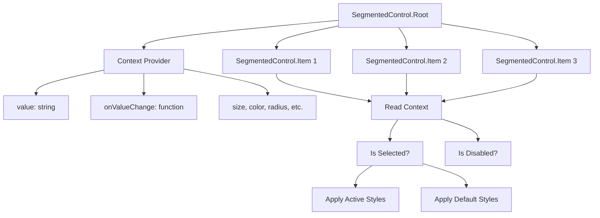

# SegmentedControl Refactoring Plan: Compound Component Pattern

## Overview

Refactor the existing `SegmentedControl` component from an array-based `options` prop pattern to the compound component pattern (Web/Radix UI pattern).

## Current API (Problem)

```tsx
interface SegmentedControlProps {
  value: string;
  onValueChange: (value: string) => void;
  options: SegmentedControlOption[];
  // ... other props
}

interface SegmentedControlOption {
  label: string;
  value: string;
  icon?: ReactNode;
}
```

Usage:
```tsx
<SegmentedControl
  value={selected}
  onValueChange={setSelected}
  options={[
    { value: 'inbox', label: 'Inbox', icon: <Icon /> },
    { value: 'drafts', label: 'Drafts' }
  ]}
/>
```

## New API (Solution)

```tsx
// Root component
interface SegmentedControlRootProps {
  defaultValue?: string;
  value?: string;
  onValueChange?: (value: string) => void;
  disabled?: boolean;
  color?: Color;
  radius?: RadiusSize;
  size?: 1 | 2 | 3 | 4;
  style?: StyleProp<ViewStyle>;
  highContrast?: boolean;
  children: React.ReactNode;
}

// Item component
interface SegmentedControlItemProps {
  value: string;
  disabled?: boolean;
  children: React.ReactNode;
}
```

Usage:
```tsx
<SegmentedControl.Root defaultValue="inbox">
  <SegmentedControl.Item value="inbox">
    <InboxIcon /> Inbox
  </SegmentedControl.Item>
  <SegmentedControl.Item value="drafts">
    Drafts
  </SegmentedControl.Item>
  <SegmentedControl.Item value="sent" disabled>
    Sent
  </SegmentedControl.Item>
</SegmentedControl.Root>
```

## Implementation Steps

### Step 1: Create SegmentedControlContext

```tsx
interface SegmentedControlContextValue {
  value: string;
  onValueChange: (value: string) => void;
  disabled?: boolean;
  size: 1 | 2 | 3 | 4;
  color?: Color;
  radius?: RadiusSize;
  highContrast?: boolean;
  // ... styling helpers
}

const SegmentedControlContext = React.createContext<SegmentedControlContextValue | null>(null);
```

### Step 2: Create SegmentedControl.Root

- Accepts `defaultValue` (uncontrolled) or `value` (controlled)
- Manages internal state for uncontrolled mode
- Provides context to children
- Renders container View with accessibility role
- Validates that all children have unique values

### Step 3: Create SegmentedControl.Item

- Accepts `value` and optional `disabled` props
- Extracts children as content (allows icons + text)
- Reads context for selection state and callbacks
- Renders TouchableOpacity with proper styling
- Handles press events

### Step 4: Backward Compatibility (Optional)

Optionally support `options` prop for simple cases:

```tsx
<SegmentedControl.Root
  value={selected}
  onValueChange={setSelected}
  options={[
    { value: 'inbox', label: 'Inbox', icon: <Icon /> }
  ]}
/>
```

## File Changes

| File | Change |
|------|--------|
| `packages/radix-ui-themes-native/src/components/navigation/SegmentedControl.tsx` | Refactor to compound pattern |
| `packages/radix-ui-themes-native/src/components/navigation/index.ts` | Update exports |
| `apps/playground-native/app/demo/segmented_control/index.tsx` | Update demo to use new API |

## Benefits

1. **Rich Content**: Can include icons, badges, or custom components in items
2. **Per-Item Props**: Each item can have its own `disabled` state
3. **Better TypeScript**: Type-safe composition
4. **Radix Consistency**: Matches official Radix UI patterns
5. **Declarative**: Structure matches visual representation

## Mermaid Diagram



## Migration Path

1. **Phase 1**: Implement compound components alongside existing API
2. **Phase 2**: Update demos to use new API
3. **Phase 3**: Add deprecation warnings for old API
4. **Phase 4**: Remove old API in next major version

## Testing Checklist

- [ ] Uncontrolled mode (defaultValue)
- [ ] Controlled mode (value + onValueChange)
- [ ] Disabled state (entire control)
- [ ] Per-item disabled state
- [ ] Size variants (1, 2, 3, 4)
- [ ] Color variants
- [ ] Radius variants
- [ ] High contrast mode
- [ ] Rich content in items (icons + text)
- [ ] Accessibility attributes
