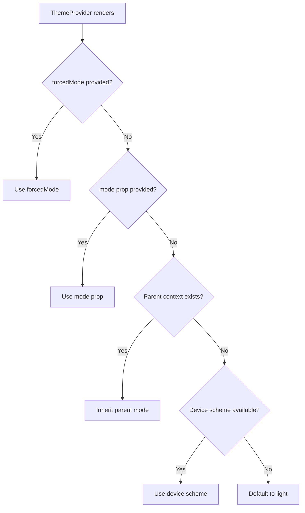

# Theme Mode Inheritance Plan

## Problem Statement

When nesting `ThemeProvider` components, the `mode` (light/dark) is not inherited from the parent. Each nested `ThemeProvider` independently determines its mode based on:

1. Its own `mode` prop
2. Its own `forcedMode` prop
3. The device color scheme (default)

This causes issues when:
- A parent `ThemeProvider` has a `ThemeToggle` that changes the mode
- Nested `ThemeProvider` components are used to customize `accentColor` or other options
- The nested providers ignore the parent's mode and reset to the device color scheme

## Example Scenario

```tsx
<ThemeProvider mode="dark">
  <ThemeProvider themeOptions={{ accentColor: 'crimson' }}>
    {/* 
     * Expected: mode = 'dark' (inherited from parent)
     * Actual: mode = device color scheme (e.g., 'light')
     */}
  </ThemeProvider>
</ThemeProvider>
```

## Proposed Solution

Modify the `ThemeProvider` to inherit the `mode` from its parent context when no explicit `mode` or `forcedMode` prop is provided.

### Implementation Changes

#### File: `packages/radix-ui-themes-native/src/theme/ThemeProvider.tsx`

**1. Read parent context at the start of ThemeProvider:**

```tsx
export const ThemeProvider: React.FC<ThemeProviderProps> = ({
  children,
  mode: initialMode,
  forcedMode,
  themeOptions = {},
  onModeChange,
  toastConfig: userToastConfig,
}) => {
  // Get parent theme context if it exists
  const parentContext = useContext(ThemeContext);
  
  const deviceColorScheme = useDeviceColorScheme();
  
  // Priority: explicit props > parent context > device scheme > 'light'
  const [mode, setMode] = useState<ThemeMode>(
    initialMode ?? 
    parentContext?.mode ?? 
    deviceColorScheme ?? 
    'light'
  );
```

**2. Update the useEffect to respect parent mode changes:**

```tsx
useEffect(() => {
  if (forcedMode !== undefined) {
    setMode(forcedMode);
  } else if (initialMode === undefined) {
    // If no explicit mode prop, inherit from parent or device
    setMode(parentContext?.mode ?? deviceColorScheme ?? 'light');
  }
}, [forcedMode, initialMode, parentContext?.mode, deviceColorScheme]);
```

### Mode Resolution Priority

The new priority order for determining the mode will be:



### Behavior Matrix

| Parent Mode | `mode` prop | `forcedMode` prop | Resulting Mode |
|-------------|-------------|-------------------|----------------|
| dark        | undefined   | undefined         | dark (inherited) |
| dark        | light       | undefined         | light (from prop) |
| dark        | undefined   | light             | light (forced) |
| undefined   | undefined   | undefined         | device scheme |

### Key Design Decisions

1. **`themeOptions` still completely overrides** - No merging of theme options, as per current behavior and user preference.

2. **Mode inheritance is implicit** - When no `mode` or `forcedMode` is provided, the nested provider inherits from parent.

3. **Parent mode changes propagate** - When parent's mode changes, nested providers without explicit mode props will update.

4. **Explicit props take precedence** - If `mode` or `forcedMode` is provided, it overrides inheritance.

5. **Toast state remains separate** - Each `ThemeProvider` still maintains its own toast queue.

## Files to Modify

1. `packages/radix-ui-themes-native/src/theme/ThemeProvider.tsx` - Main implementation

## Testing Considerations

1. Test nested providers with no mode props
2. Test nested providers with explicit mode props
3. Test mode changes propagating to nested providers
4. Test forcedMode overriding inheritance
5. Test multiple levels of nesting

## Backward Compatibility

This change is backward compatible because:
- Existing code with explicit `mode` props continues to work the same way
- The new inheritance behavior only applies when no mode props are provided
- Default behavior (no parent context) still uses device color scheme
